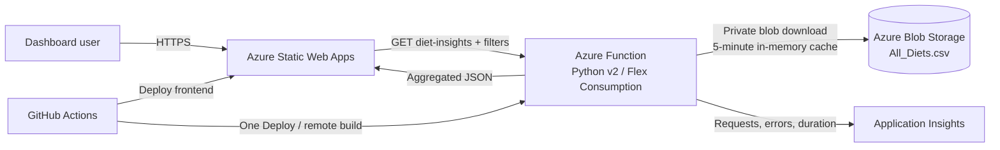

# Architecture and request flow

## Runtime sequence

1. The dashboard loads as static HTML, CSS, and JavaScript from Azure Static Web Apps.
2. The frontend calls `GET <Function API>/diet-insights` with the selected search, diet, and cuisine filters.
3. The Function downloads `datasets/All_Diets.csv` from a private Azure Blob container, or reuses the five-minute in-memory cache.
4. The shared analysis module validates required columns, normalizes labels and numeric values, and mean-imputes missing macronutrients.
5. It filters the cleaned rows and calculates summary metrics plus four chart datasets.
6. The Function returns JSON with execution duration, record counts, source metadata, API version, and a request ID.
7. The browser redraws each canvas chart and updates the accessible table.

## Trust boundaries

- Browser: public and untrusted; contains only the Function API base URL.
- Function App: trusted compute boundary; holds storage settings.
- Blob Storage: private data boundary; public blob access is disabled.
- GitHub: deployment boundary; publish profile and deployment token are stored only as encrypted repository secrets.

